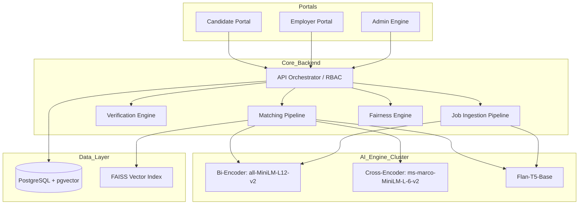
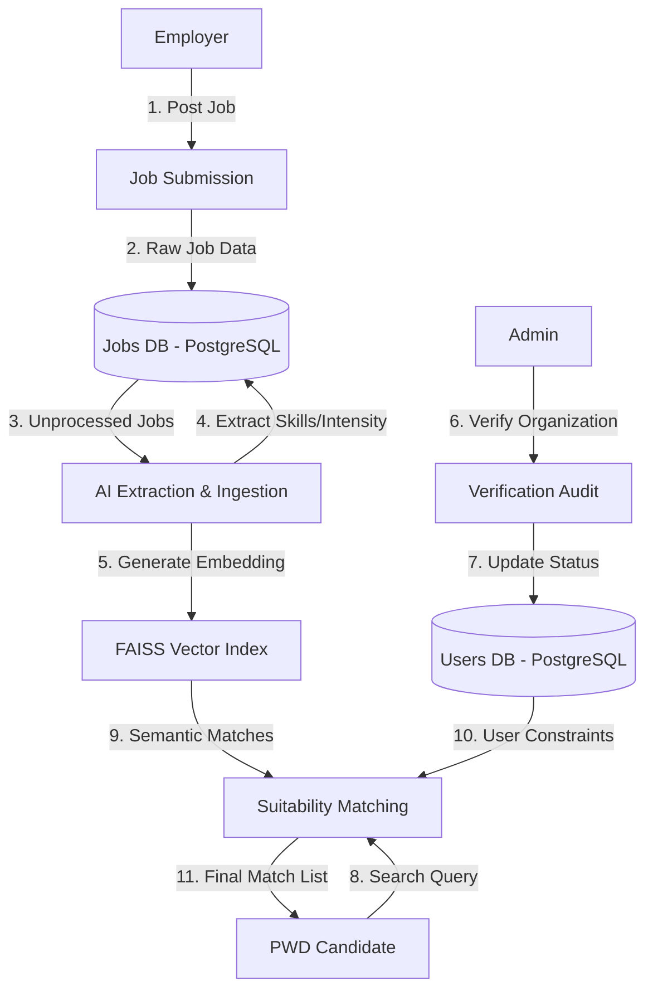
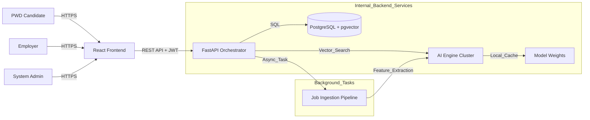
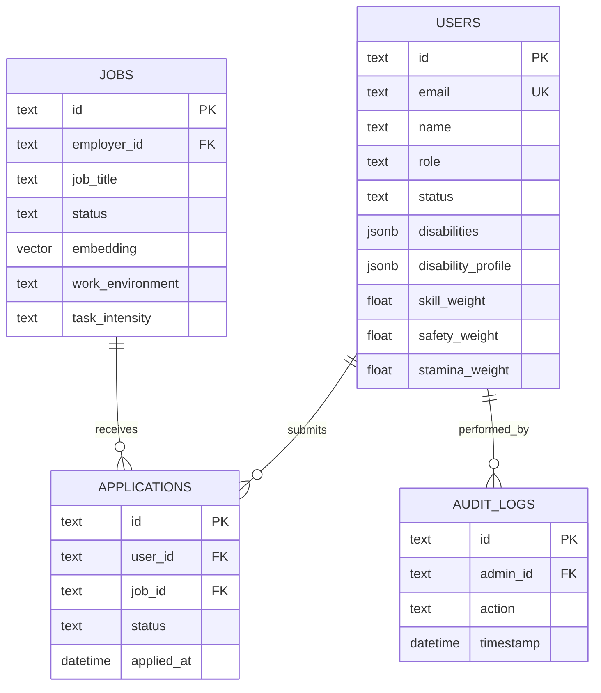

# UPLIFT: Architectural & System Flow Walkthrough (Version 8.0)

This document provides a comprehensive technical walkthrough of the UPLIFT Suitability Engine -- a **Two-Sided Vocational Marketplace** bridging Talented PWDs with Inclusive Organizations through AI-driven suitability matching.

---

## 1. System Overview & Purpose

**UPLIFT** (*A Web-Based Semantic Employment Matching and Workplace Suitability System for Persons with Disabilities at the National Council on Disability Affairs*) is a web-based platform that moves beyond traditional keyword-based job matching. It utilizes a **4-stage AI pipeline** to evaluate the suitability of a role based on environmental, physical, and cognitive demands against a candidate's specific accessibility needs.

### Core Objectives

*   **Empower PWDs**: Provide transparent, AI-driven career guidance and job matching with personalized Suitability Reports.
*   **Support Inclusive Employers**: Offer tools to model jobs accurately and reach a verified, diverse talent pool.
*   **Ensure Safety & Trust**: Rigorous verification engine for organizations and high-fidelity auditing for all job postings.

### The Three Stakeholders

| Stakeholder | Role | Primary Action |
|:---|:---|:---|
| **PWD Candidates** | Job Seekers with various disabilities (Physical, Visual, Hearing, Learning, Psychosocial, etc.) | Create profiles, discover AI-aligned career paths, receive Suitability Reports, adjust matching weights |
| **Employers** | Inclusive organizations seeking to diversify their workforce | Undergo 3-step verification, post high-fidelity jobs, review applicants |
| **System Admins (NCDA)** | Auditors of marketplace integrity | Audit organization credentials, approve jobs, monitor system health and audit logs |

---

## 2. High-Level Architecture

UPLIFT follows a **Modular Monolith** architecture with a specialized **Matching Pipeline** and a **Verification Engine**.

### The Ecosystem



1.  **Candidate Portal**: Interface for PWDs to manage profiles, adjust matching weights, and discover AI-aligned career paths.
2.  **Employer Portal**: Premium management hub for inclusive organizations to post high-fidelity jobs and review applicants.
3.  **Admin Engine**: Centralized verification and ingestion system that audits organizations and job postings before they enter the AI index.

---

## 3. Complete Tech Stack

### Backend Infrastructure

| Technology | Version | Role |
|:---|:---|:---|
| **Python** | 3.9+ | Core backend language |
| **FastAPI** | 0.135.3 | High-performance async API orchestration with automatic OpenAPI docs |
| **Uvicorn** | 0.44.0 | ASGI server for FastAPI |
| **PostgreSQL** | -- | Primary relational database |
| **pgvector** | 0.2.5+ | Vector extension for PostgreSQL -- stores 384-dim job embeddings natively |
| **FAISS** (faiss-cpu) | 1.13.2 | Geometric vector index for constant-time semantic retrieval |
| **PyJWT** | -- | JWT authentication (HS256, 30-day tokens) |
| **PBKDF2-SHA256** | -- | Password hashing with static salt |

### AI / NLP Engine

| Model | Architecture | Purpose |
|:---|:---|:---|
| **all-MiniLM-L12-v2** | Bi-Encoder Transformer | Produces 384-dimensional vectors for semantic search |
| **ms-marco-MiniLM-L-6-v2** | Cross-Encoder Transformer | High-precision pairwise validation for physical safety re-ranking |
| **google/flan-t5-base** | Seq2Seq Transformer | Generative feature extraction from job posts + Suitability Report generation |
| **PyTorch** | 2.11.0 | AI inference runtime |
| **Sentence-Transformers** | 5.4.1 | Model loading and embedding generation |
| **Transformers** (HuggingFace) | 5.5.4 | Tokenizer and model interface |

### Fairness & Compliance

| Technology | Version | Purpose |
|:---|:---|:---|
| **AIF360** (IBM) | 0.6.1 | Algorithmic fairness auditing -- demographic parity, reweighing preprocessing |

### Frontend

| Technology | Version | Purpose |
|:---|:---|:---|
| **React** | 19.2.5 | Component-based SPA with accessibility-first design (WCAG 2.1) |
| **Vite** | 8.0.10 | Build tool with dev server proxy to backend (:8000) |
| **Tailwind CSS** | 4.2.4 | Utility-first styling framework |
| **React Router** | 7.14.2 | Client-side routing |
| **Axios** | 1.16.0 | HTTP client for API communication |
| **Framer Motion** | 12.38.0 | UI animation and transitions |
| **Lucide React** | 1.14.0 | Accessible icon system |
| **pdfjs-dist** | 6.2.108 | In-browser PDF rendering |

### Document Generation

| Technology | Purpose |
|:---|:---|
| **RenderCV** | LaTeX-powered professional PDF resume generation |
| **Typst** | PDF compilation engine (via RenderCV) |
| **pydparser** | Structured data extraction from uploaded resumes |

---
## 4. Data Flow Diagram (DFD -- Level 1)



### Dataflow Narrative

| Flow | Description |
|:---|:---|
| 1-2 | Employer submits a job posting. Raw data enters the Jobs DB in `pending` status. |
| 3-5 | AI Ingestion Pipeline extracts skills, intensity, and flexibility via Flan-T5, then vectorizes via Bi-Encoder. Job is approved and indexed. |
| 6-7 | Admin verifies employer credentials (SEC/DTI permits). User status updated to `active`. |
| 8-10 | PWD triggers a suitability search. FAISS retrieves semantic matches; user constraints (weights, capabilities) are loaded. |
| 11 | Hybrid scoring produces a ranked list of the top 10 most suitable, safe jobs. |

---

## 5. Network Architecture



The system operates on a **Client-Server Architecture**. The Frontend (React/Vite) communicates with the Backend (FastAPI) via a secure REST API. All sensitive transactions (Auth/Approvals) are secured via **JWT (JSON Web Tokens)** with **Role-Based Access Control (RBAC)**.

Internally, the backend manages a low-latency connection to **PostgreSQL + pgvector** for relational and vector storage, and a high-performance **FAISS index** for in-memory semantic search. Background workers handle the heavy lifting of AI ingestion, ensuring the primary user experience remains fluid.

---

## 6. Database Schema (ERD)



### Key Tables

| Table | Purpose |
|:---|:---|
| `users` | Stores PWD profiles, employer metadata, and admin accounts. Contains matching weights, disability profiles, and verification data. |
| `jobs` | High-fidelity job listings with 12-dimensional accessibility metadata and pgvector embeddings. |
| `applications` | Links candidates to jobs. Stores optional auto-generated RenderCV resumes as base64 PDFs. |
| `audit_logs` | System-wide activity tracking for admin oversight -- every approval/rejection is logged. |
| `match_logs` | Historical match results used by the Fairness Engine for per-group analysis (30-day bounded retention). |
| `system_settings` | Global configuration key-value store (e.g., resume theme). |
| `ph_schools` | 198 curated Philippine educational institutions for education autocomplete during profile creation. |

### Users Table -- Full Schema

| Column | Type | Description |
|:---|:---|:---|
| `id` | TEXT (PK) | UUID primary key |
| `email` | TEXT (UNIQUE) | Login identifier |
| `password_hash` | TEXT | PBKDF2-SHA256 hashed password |
| `name` | TEXT | Full name |
| `role` | TEXT | `user` / `employer` / `admin` |
| `status` | TEXT | `active` / `pending` / `rejected` |
| `summary` | TEXT | Professional summary |
| `skills` | TEXT | Comma-separated skill list |
| `disabilities` | JSONB | Array of disability entries |
| `disability_profile` | JSONB | Structured profile with capability levels |
| `skill_weight` | REAL | User preference (default 0.5) |
| `safety_weight` | REAL | User preference (default 0.5) |
| `stamina_weight` | REAL | User preference (default 0.5) |
| `preferred_intensity` | TEXT | `Low` / `Medium` / `High` |
| `requires_flexibility` | INT | 0/1 boolean |
| `education` | JSONB | Structured education entries |
| `experience` | JSONB | Structured experience entries |
| `projects` | JSONB | Project portfolio |
| `certifications` | JSONB | Professional certifications |
| `awards` | JSONB | Awards and recognitions |
| `verification_data` | JSONB | Employer verification documents |
| `auto_generate_resume` | INT | 0/1 boolean for auto resume generation |

### Jobs Table -- Full Schema

| Column | Type | Description |
|:---|:---|:---|
| `id` | TEXT (PK) | UUID primary key |
| `employer_id` | TEXT (FK) | References users.id |
| `employer_name` | TEXT | Denormalized employer name |
| `job_title` | TEXT | Job position title |
| `job_description` | TEXT | Full job description |
| `physical_requirements` | TEXT | Physical demands and environment details |
| `status` | TEXT | `pending` / `approved` |
| `embedding` | VECTOR(384) | pgvector 384-dim embedding from Bi-Encoder |
| `task_intensity` | TEXT | `Low` / `Medium` / `High` (Flan-T5 extracted) |
| `has_flexibility` | INT | 0/1 boolean (Flan-T5 extracted) |
| `structured_skills` | TEXT | Comma-separated skills (Flan-T5 extracted) |
| `work_environment` | TEXT | `Indoor` / `Outdoor` / `Hybrid` / `Remote` |
| `work_tempo` | TEXT | `Relaxed` / `Moderate` / `High` |
| `cognitive_load` | TEXT | Cognitive demand level |
| `sensory_load` | TEXT | Sensory stimulation level |
| `social_interaction` | TEXT | Social interaction level |
| `visual_demand` | TEXT | Visual requirement level |
| `auditory_demand` | TEXT | Auditory requirement level |
| `fine_motor_demand` | TEXT | Fine motor dexterity level |
| `physical_demand` | TEXT | Physical exertion level |
| `remote_friendly` | INT | 0/1 boolean |

---
## 7. AI Engine Cluster

### The Three Models

| Model | Type | Dimension | Purpose |
|:---|:---|:---|:---|
| `all-MiniLM-L12-v2` | Bi-Encoder | 384-dim | Semantic retrieval -- converts profiles/jobs into a shared hyperspace for fast similarity search |
| `ms-marco-MiniLM-L-6-v2` | Cross-Encoder | Scalar | Safety validation -- processes user+job pairs simultaneously to detect hidden barriers |
| `google/flan-t5-base` | Seq2Seq LLM | -- | Feature extraction from raw job posts + generative Suitability Report writing |

### NLP Conceptual Diagram

```mermaid
flowchart TD
    User["PWD Profile"] --> Matcher["Suitability Matcher"]
    Job["Job Description"] --> Matcher

    subgraph "AI Suite (NLP Cluster)"
        direction TB
        M1["Bi-Encoder: all-MiniLM-L12-v2"]
        M2["Cross-Encoder: ms-marco-MiniLM"]
        M3["Gen-AI: Flan-T5-Base"]
    end

    Matcher --> M1
    M1 -- "Semantic Retrieval (FAISS)" --> TopK["Top 30 Matches"]

    TopK --> M2
    M2 -- "Barrier Re-ranking" --> Score["High-Fidelity Safety Score"]

    Score --> M3
    M3 -- "Generative Reasoning" --> Report["Final Suitability Report"]

    subgraph "Branding Suite"
        direction LR
        Parser["pydparser (Resume Parsing)"]
        Render["RenderCV (LaTeX Engine)"]
    end
end
```

### Bi-Encoder: all-MiniLM-L12-v2

The Bi-Encoder produces 384-dimensional dense vector representations of text. Unlike Cross-Encoders, it encodes each text independently, enabling efficient comparison via vector similarity. Both user profiles and job descriptions are projected into a shared hyperspace, allowing the system to find thematically similar roles in milliseconds using FAISS.

### Cross-Encoder: ms-marco-MiniLM-L-6-v2

The Cross-Encoder processes the user profile and job requirements as a single concatenated input. This allows it to model fine-grained interactions between the two texts, making it ideal for detecting "hidden barriers" (e.g., a "desk job" that actually requires frequent warehouse visits). It produces a single relevance score per pair.

### Flan-T5-Base (Google)

A Sequence-to-Sequence Transformer used for two critical tasks:
1. **Feature Extraction**: Automatically extracts Task Intensity, Schedule Flexibility, and Skills from raw job descriptions using zero-shot prompting.
2. **Suitability Report Generation**: Produces personalized 4-section analytical reports (Compatibility, Performance, Advice, Challenges) grounded in calculated metrics using Context-Question-Answer (CQA) prompting.

---

## 8. The Matching Pipeline (4 Stages)

The core of UPLIFT is the **Suitability Engine** -- a 4-stage pipeline that transforms raw profile and job data into personalized suitability reports.

### Stage 1: Semantic Retrieval (FAISS + Bi-Encoder)

**Purpose**: Fast semantic scan to filter hundreds of jobs down to the top 30 candidates.

**Process**:
1. **Profile Context Building** (disability-blind): Skills, education, summary, experience, projects, certifications, awards. Disability data is *never* fed into the embedding model -- this is a core design principle.
2. **Vectorization**: User context is encoded by `all-MiniLM-L12-v2` into a 384-dimensional dense vector.
3. **FAISS Index Search**: A dynamic `IndexFlatIP` (Inner Product) index is built from all approved job embeddings. Both query and job vectors are L2-normalized before search, making Inner Product mathematically equivalent to Cosine Similarity.
4. **Output**: Top 30 most semantically similar jobs.

**The Formula** (for normalized vectors):

```
Score = cos(theta) = (A . B) / (||A|| * ||B||)
```

**Normalization to 0-100 scale**:

```
Bi-Score = min(100, max(0, (raw_sim - 0.25) / 0.5 * 100))
```

### Stage 2: Cross-Encoder Re-ranking

**Purpose**: High-precision validation to detect subtle environmental barriers.

**Process**:
1. For each of the top 30 candidates, the system pairs the user's profile context with the job's `physical_requirements`.
2. The Cross-Encoder processes each pair simultaneously, producing a raw logit score.
3. The logit is calibrated using a modified Sigmoid with temperature scaling (T=1.2) and optimistic bias (+1.5).

**The Formula**:

```
Cross-Score = (1 / (1 + e^(-(logit + 1.5) / 1.2))) * 100
```

**Rationale**: The bias ensures jobs are not overly penalized for missing data, while the temperature softens the decision boundary for more nuanced matching.

### Stage 3: Hybrid Scoring (4 Components)

The final score is computed from four independent scoring components:

#### Component 1: Physical Safety Score

A blend of Bi-Encoder broad semantic match and Cross-Encoder precision validation.

```
safety_score = (bi_score * 0.30) + (cross_score * 0.70)
```

The Cross-Encoder is weighted 70% because it processes the user+job pair together, providing higher-fidelity safety assessment.

#### Component 2: Skill Alignment Score

Combines exact keyword overlap with semantic similarity for a "human-like" skill assessment.

```
keyword_score = (matched_skills / total_job_skills) * 100
skill_score = (keyword_score * 0.5) + (bi_score * 0.5)
```

A minimum baseline of 40% is enforced if semantic relevance exceeds 50%, ensuring that semantically relevant jobs are not penalized for using different terminology.

#### Component 3: Stamina / Sustainability Score

Starts at 100.0 and applies discrete vocational penalties:

| Condition | Penalty |
|:---|:---|
| Job Intensity > User Preference (1 step) | -25 points |
| Job Intensity > User Preference (2 steps) | -50 points |
| High Intensity + No Flexibility | -20 points (burnout risk) |
| User Requires Flexibility + Job Has None | -30 points |

#### Component 4: Capability Compatibility Score

A **9-dimension** comparison between the user's functional capability profile and the job's demands. This is the core disability-aware matching component, implemented in `compatibility_engine.py`.

| Dimension | What It Measures | Mapping |
|:---|:---|:---|
| `fine_motor` | Fine-motor dexterity and manual dexterity | Low/Medium/High |
| `physical` | Physical mobility and exertion (lifting/standing/walking) | Low/Medium/High |
| `cognitive` | Cognitive and analytical tasks | Low/Medium/High |
| `sensory` | Environmental sensory comfort (lighting and sound) | Low/Medium/High |
| `social` | Interpersonal and team communication | Low/Moderate/High |
| `visual` | Visual acuity and screen focus | Low/Medium/High |
| `auditory` | Auditory comprehension | Low/Medium/High |
| `tempo` | Work pace and operational tempo | Low/Relaxed/Medium/Moderate/High |
| `intensity` | Concurrent task intensity | Low/Medium/High |

**Scoring per dimension**:

| Gap (Job - User) | Verdict | Score |
|:---|:---|:---|
| 0 or negative (job demand <= user comfort) | Match (Good fit) | 100 |
| +1 step above user comfort | Marginal (Close match) | 60 |
| +2 steps above user comfort | Mismatch (Needs support) | 20 |

**Overall capability score**: Mean of all 9 dimensions, capped at 40 if any dimension scores 20 (hard fail).

Each dimension produces a natural-language explanation explaining why the match/mismatch exists, the source of the capability level (stated in profile vs. derived from preset), and the recommended accommodation.

#### Final Weighted Score

```
final = (safety * w_safety + skill * w_skill + stamina * w_stamina + compat * w_ontology) / total_weight
```

Where `w_safety`, `w_skill`, `w_stamina` are user-adjustable weights (default 0.5 each) and `w_ontology` is fixed at 0.5.

### Stage 4: LLM Analysis (Flan-T5-Base)

**Purpose**: Generate personalized, human-readable Suitability Reports for matches scoring >= 50%.

**Process**: Uses Context-Question-Answer (CQA) prompting with strict grounding in calculated metrics to produce 4 narrative sections:

1. **Compatibility** -- Why the role is accessible and safe, grounded in safety and ontology scores.
2. **Performance** -- Expected workplace performance, grounded in skill alignment score.
3. **Advice** -- Ergonomic and workflow recommendations, grounded in capability compatibility and accommodations.
4. **Challenges** -- Potential barriers and fatigue considerations, grounded in stamina score.

If the LLM output is below quality thresholds (< 40 chars or contains biased language), grounded fallbacks from the capability engine are used instead.

### Query Relevance Boost

If the user provides a search query, additional score bonuses are applied:

| Match Type | Bonus |
|:---|:---|
| Job title contains query | +25 |
| Employer name, location, or skills contain query | +15 |
| Job description contains query | +8 |

---
## 9. Matching Criteria Summary

| Criterion | What It Measures | Weight | Source |
|:---|:---|:---|:---|
| **Physical Safety** | Cross-encoder + Bi-encoder blend for environmental fit | User-adjustable (default 0.5) | `server.py` |
| **Skill Alignment** | 50% keyword overlap + 50% semantic similarity | User-adjustable (default 0.5) | `server.py` |
| **Stamina/Sustainability** | Task intensity vs user preference with burnout penalties | User-adjustable (default 0.5) | `server.py` |
| **Capability Compatibility** | 9-dimension disability-aware matching with natural language explanations | Fixed (0.5) | `compatibility_engine.py` |

### Capability Presets (Disability Taxonomy)

The system contains a comprehensive taxonomy mapping **25+ disability types** across 7 categories to functional capability profiles. Each preset includes recommended workplace accommodations.

| Category | Subtypes | Capability Dimensions Set |
|:---|:---|:---|
| **Physical** | Wheelchair User, Amputee (7 subtypes: Finger, Hand, Forearm, Upper Arm, Leg, Toe, Other), Cerebral Palsy, Muscular Dystrophy, Chronic Pain | fine_motor, physical, energy, preferred_intensity |
| **Visual** | Total Blindness, Low Vision, Color Blindness | visual, sensory, cognitive |
| **Hearing** | Profoundly Deaf, Hard of Hearing, Auditory Processing | auditory, social, sensory |
| **Learning** | Autism (ASD), ADHD, Dyslexia, Dysgraphia | cognitive, sensory, social |
| **Intellectual** | Down Syndrome, Developmental Delay | cognitive, sensory |
| **Psychosocial** | Bipolar Disorder, Depression, Anxiety Disorder, PTSD, Schizophrenia | cognitive, social, energy, sensory |
| **Chronic Illness** | Cancer Patient/Survivor, Rare Disease, Speech Impairment, Chronic Respiratory | energy, physical, social |

---

## 10. Core Workflows

### A. Employer Onboarding

```
Registration (status: pending) --> 3-Step Verification --> Admin Audit --> Dashboard Activation
```

1. Employer creates account (status: `pending`).
2. Submits business credentials: Address verification, TIN, SEC/DTI documents.
3. System admin reviews documents via the Admin Portal.
4. On approval, status changes to `active` and dashboard is unlocked.

### B. Job Ingestion Pipeline

```
Raw Job --> Flan-T5 Extraction --> Bi-Encoder Vectorization --> PostgreSQL + pgvector Storage
```

1. Employer submits job with raw description and physical requirements.
2. Job enters `pending` status in the database.
3. **Background Task** triggers the ingestion pipeline:
   - **Flan-T5** extracts structured features using zero-shot prompting:
     ```
     Context: {job_description} {physical_requirements}
     Question: What is the task intensity (Low, Medium, High)?
               Does it offer schedule flexibility (Yes, No)?
               List the professional skills.
     Answer format: Intensity: [type], Flexibility: [Yes/No], Skills: [list]
     ```
   - Regex parsing extracts values from the model's natural language output.
4. **Bi-Encoder** builds a rich semantic envelope from job title, description, requirements, environment, and tempo, then produces a 384-dim embedding.
5. Job is updated with embedding, extracted features, and status changes to `approved`.
6. Job is now searchable in the FAISS index.

### C. PWD Matching

```
Profile Input --> Disability-Blind Context --> FAISS Retrieval (Top 30) --> Cross-Encoder Re-ranking
--> 4-Component Scoring --> Fairness Audit --> LLM Report --> Dashboard Output
```

1. PWD triggers a suitability search (optionally with a text query).
2. System builds a disability-blind context (skills, education, summary, experience).
3. Bi-Encoder vectorizes the context; FAISS retrieves top 30 matches.
4. Cross-Encoder re-ranks pairs for physical safety validation.
5. Four scoring components are computed: Safety, Skill, Stamina, Capability Compatibility.
6. Fairness Engine logs results, computes group report, and applies reweighing adjustments.
7. Flan-T5 generates Suitability Reports for matches >= 50%.
8. Top 10 results are returned with full explanations, metrics, and accommodations.

### D. Application Flow

```
User Applies --> Optional Auto-Generated Resume --> Base64 PDF Storage --> Employer Review
```

1. User clicks "Apply Now" on a matched job.
2. If `auto_generate_resume` is enabled, the system generates a RenderCV resume.
3. Resume is stored as base64 in the `applications` table.
4. Employer views applications with candidate profiles and resumes.

### E. Resume Generation (RenderCV Pipeline)

```
Profile Data --> RenderCV YAML --> Typst Compilation --> LaTeX PDF --> Base64 Output
```

1. User profile fields (education, experience, skills, projects, certifications, awards) are parsed into RenderCV-compatible format.
2. A YAML configuration is built with the selected theme (9 available: classic, ember, engineeringclassic, engineeringresumes, harvard, ink, moderncv, opal, sb2nov).
3. RenderCV generates Typst source from the YAML model.
4. Typst compiles the source into a high-fidelity PDF.
5. PDF bytes are base64-encoded for storage and transmission.

---

## 11. Fairness & Accessibility

### AIF360 Fairness Engine

The system integrates IBM's AI Fairness 360 toolkit to detect and mitigate algorithmic bias across disability groups.

**Disability Groups Tracked**: Physical, Visual, Hearing, Learning, Intellectual, Psychosocial, Chronic_Illness

**Key Metrics**:
- **Demographic Parity Ratio**: Measures whether favorable match outcomes are distributed equally across disability groups.
- **Statistical Parity Difference**: Quantifies the absolute difference in favorable rates between groups.
- **Disparate Impact**: Ratio of favorable rates between unprivileged and privileged groups.

**Reweighing Preprocessing**: When historical data shows disparities, the system applies instance-level weight adjustments to correct for systematic bias. The correction is bounded to +/-15% to prevent over-correction.

**Bounded Retention**: Match logs older than 30 days are pruned to keep fairness statistics current and the database manageable.

### Workplace Suitability Index

A **4-pillar weighted index** measuring how well a workplace can genuinely accommodate a PWD candidate:

| Pillar | Weight | Legal Basis | Measurement |
|:---|:---|:---|:---|
| **Physical Accessibility** | 25% | BP 344 (Accessibility Law, 1982) | Detects keywords: ramp, elevator, accessible parking, restroom, braille, signage, ergonomic, etc. |
| **Digital Accessibility** | 20% | RA 10524 | Detects: screen reader, assistive tech, caption, voice command, adaptive, remote software. Bonus for flexible work. |
| **Policy Support** | 20% | RA 10524 | Detects: inclusive, accommodation, equal opportunity, non-discrimination, PWD, DOLE, quota. |
| **Task Capability** | 35% | Personalized matching | Reuses the capability-compatibility score from the matching engine. |

```
Suitability Index = 0.25 * Physical + 0.20 * Digital + 0.20 * Policy + 0.35 * Task
```

Remote-friendly roles receive automatic 100% on Physical and Digital pillars since physical workplace features are not required.

### Accessibility Features (Frontend)

- **AccessibilityFab**: Floating action button allowing users to adjust UI scaling, contrast, and font types.
- **Semantic HTML**: Proper ARIA labeling for screen reader compatibility.
- **WCAG 2.1 Compliance**: Accessibility-first design principles throughout the frontend.

---

## 12. Performance & Scalability Features

### Two-Phase Ingestion

Complex AI extraction (skills, intensity, flexibility) happens at the time of job posting via background tasks, not during search. This ensures the user experience remains "search-engine fast."

### Constant-Time Retrieval

FAISS `IndexFlatIP` indexing ensures that matching performance does not degrade as the number of employers or jobs grows. The index is built dynamically from stored pgvector embeddings on each search query.

### Bounded Retention

Match logs older than 30 days are automatically pruned, keeping the fairness statistics pipeline performant and the database size manageable.

---

## 13. API Endpoint Summary

### Authentication

| Method | Path | Auth | Description |
|:---|:---|:---|:---|
| POST | `/api/auth/register` | None | PWD candidate registration |
| POST | `/api/auth/register/employer` | None | Employer registration (status: pending) |
| POST | `/api/auth/login` | None | Login, returns JWT + full user profile |
| POST | `/api/auth/logout` | None | Logout |
| POST | `/api/auth/change-password` | JWT | Change password |
| DELETE | `/api/auth/delete-account` | JWT | Delete account |
| GET | `/api/auth/me` | JWT | Get current user profile |

### PWD Candidate

| Method | Path | Auth | Description |
|:---|:---|:---|:---|
| PUT | `/api/pwd/profile` | user | Update profile |
| POST | `/api/pwd/suitability-match` | user | Run 4-stage matching pipeline |
| GET | `/api/pwd/job-analysis/{job_id}` | user | Get detailed analysis for a specific job |

### Employer

| Method | Path | Auth | Description |
|:---|:---|:---|:---|
| GET | `/api/employer/stats` | employer (active) | Dashboard statistics |
| GET | `/api/employer/jobs` | employer (active) | List employer's jobs |
| POST | `/api/employer/jobs` | employer (active) | Create job (triggers ingestion pipeline) |
| PUT | `/api/employer/jobs/{job_id}` | employer (active) | Update job |
| DELETE | `/api/employer/jobs/{job_id}` | employer (active) | Delete job |
| GET | `/api/employer/applications` | employer (active) | View applications |
| PATCH | `/api/employer/applications/{app_id}` | employer (active) | Update application status |
| POST | `/api/employer/verify` | employer | Submit verification documents |
| POST | `/api/employer/ai-analyze-description` | employer/admin | AI-powered job description analysis |

### Admin

| Method | Path | Auth | Description |
|:---|:---|:---|:---|
| GET | `/api/admin/system-info` | admin | System health and statistics |
| GET | `/api/admin/employers/{status}` | admin | List employers by status |
| POST | `/api/admin/verify-employer/{user_id}` | admin | Approve/reject employer |
| GET | `/api/admin/jobs/{status}` | admin | List jobs by status |
| POST | `/api/admin/approve-job/{job_id}` | admin | Approve job (triggers ingestion) |
| DELETE | `/api/admin/delete-job/{job_id}` | admin | Delete job |
| GET | `/api/admin/logs` | admin | Audit log history |
| GET | `/api/admin/fairness-report` | admin | AIF360 fairness audit report |

### Public

| Method | Path | Auth | Description |
|:---|:---|:---|:---|
| GET | `/api/public/jobs` | None | Browse approved jobs |
| GET | `/api/public/jobs/{job_id}` | None | View job details |
| GET | `/api/schools` | None | Philippine schools autocomplete |

---

## 14. Summary of Innovation

The UPLIFT architecture (v8.0) is a **Trust-Based AI Marketplace** that transforms recruitment from a search-and-apply process into a **Suitability-Validated** journey.

**Key Innovations**:

1. **Disability-Blind Semantic Search**: Profile embeddings never include disability data, ensuring fair skill-based retrieval while disability-aware matching happens transparently in the scoring layer.
2. **9-Dimension Capability Matching**: Goes beyond coarse disability categories to compare functional capability levels against job demands dimension-by-dimension.
3. **4-Stage AI Pipeline**: Combines speed (Bi-Encoder FAISS), precision (Cross-Encoder), vocational expertise (Stamina Math), and generative reasoning (Flan-T5) into a single cohesive pipeline.
4. **Algorithmic Fairness**: AIF360-powered auditing ensures no disability group is systematically disadvantaged by the matching algorithm.
5. **Offline-First AI**: All models run locally for RA 10173 (Data Privacy Act) compliance -- no user data leaves the server.
6. **High-Fidelity Job Modeling**: Jobs are represented as 12-dimensional vocational vectors capturing environmental, physical, cognitive, and accessibility dimensions.
