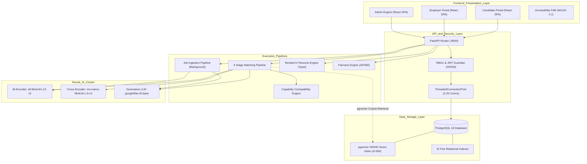
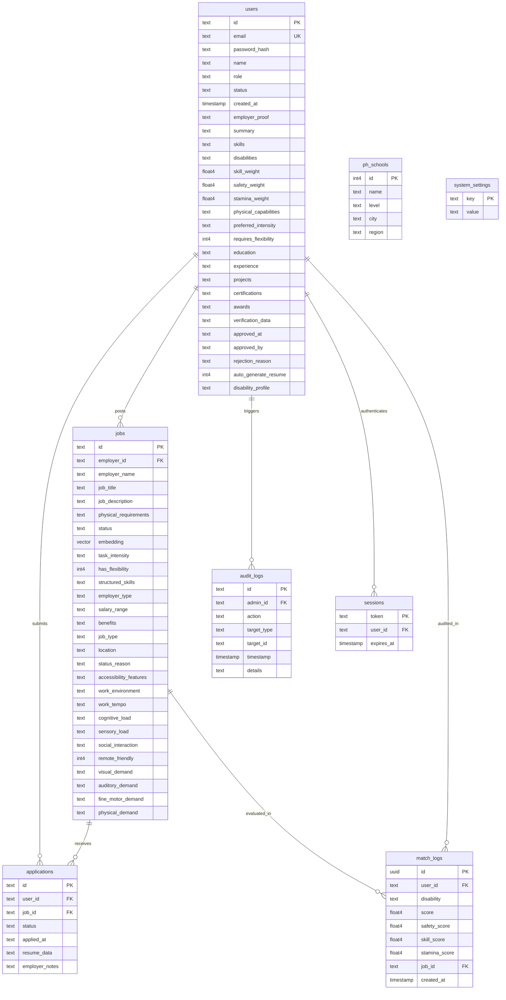
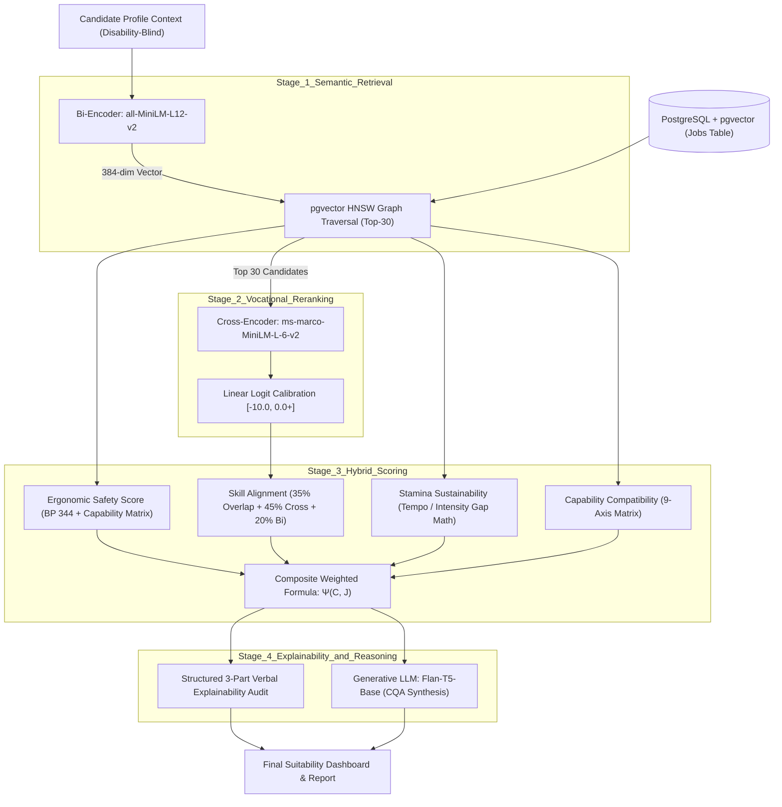

# UPLIFT: Architectural & System Flow Walkthrough (Version 9.0)

This document provides a comprehensive technical and architectural walkthrough of the **UPLIFT Suitability Engine** — a **Two-Sided Inclusive Vocational Marketplace** bridging Talented Persons with Disabilities (PWDs) with Inclusive Organizations through AI-driven workplace suitability matching, deterministic capability verification, and ethical algorithmic auditing.

---

## 1. System Overview & Purpose

**UPLIFT** (*A Web-Based Semantic Employment Matching and Workplace Suitability System for Persons with Disabilities at the National Council on Disability Affairs*) moves beyond obsolete keyword matching. It deploys a **4-Stage AI/Ergonomic Pipeline** grounded in Philippine disability legislation to mathematically evaluate workplace suitability, physical safety, operational tempo, and vocational competence.

### Core Objectives
*   **Empower PWD Candidates**: Provide objective, transparent, and auditable career matching with personalized Suitability Reports without categorical disability stereotyping.
*   **Support Inclusive Employers**: Provide tools to model workstation ergonomics, specify accommodations, and recruit from an audited, verified talent pool.
*   **Ensure Safety, Trust & Compliance**: Integrate strict **Human-in-the-Loop (HITL)** employer verification, full audit logging, and compliance with **RA 10173** (Data Privacy Act), **BP 344** (Accessibility Law), and **RA 10524** (Equal Opportunity Employment for PWDs).

---

## 2. System Input-Process-Output (IPO) Model

The UPLIFT platform is structured around a multi-tier **Input-Process-Output (IPO)** architecture governing Candidates, Employers, and Administrators.

```
+----------------------------------------------------------------------------------------------------+
|                                    UPLIFT SYSTEM IPO FRAMEWORK                                     |
+----------------------------------------------------------------------------------------------------+
| INPUTS                                                                                             |
| 1. Candidate Context:                                                                              |
|    - Education, skills, professional summary, portfolio, and experience (Disability-Blind Context).|
|    - Functional capability matrix across 9 ergonomic axes (Low=1, Med=2, High=3).                  |
|    - Personalized matching weights: w_safety, w_skill, w_stamina in [0.1, 1.0].                    |
|    - Search query or targeted role intent.                                                         |
| 2. Employer Data:                                                                                  |
|    - Job title, duties, salary, work environment (Indoor/Outdoor/Hybrid/Remote).                   |
|    - Workplace physical demands (lifting, sitting, standing) and tempo (Relaxed/Moderate/High).   |
|    - BP 344 accessibility features (ramps, elevators, accessible restrooms, adaptive software).    |
|    - Business verification documents (SEC/DTI permits, BIR TIN).                                   |
| 3. Administrative Audits:                                                                          |
|    - Human-in-the-loop review decisions, system settings, fairness baselines.                     |
+----------------------------------------------------------------------------------------------------+
                                                  |
                                                  v
+----------------------------------------------------------------------------------------------------+
| PROCESSES                                                                                          |
| 1. Two-Phase Ingestion & Feature Extraction:                                                        |
|    - Background Flan-T5 zero-shot extraction: task intensity, schedule flexibility, skills.        |
|    - Bi-Encoder (all-MiniLM-L12-v2) semantic envelope synthesis -> 384-dim dense vector.           |
| 2. Stage 1: Vector Retrieval (PostgreSQL + pgvector HNSW):                                         |
|    - Real-time iterative graph search: ORDER BY embedding <=> query_vector ASC LIMIT 30.          |
|    - Integrated relational pre-filtering: WHERE status = 'approved' AND embedding IS NOT NULL.     |
| 3. Stage 2: Precision Vocational Re-Ranking (Cross-Encoder):                                       |
|    - ms-marco-MiniLM-L-6-v2 evaluates joint attention on [User Context, Job Description].          |
|    - Linear logit calibration [-10.0, 0.0+] -> continuous vocational relevance score (0-100%).    |
| 4. Stage 3: Hybrid Scoring & Ergonomic Compatibility (UMSEF):                                      |
|    - Physical Safety: Deterministic 9-dimension capability comparison + BP 344 accommodation match.|
|    - Skill Alignment: 35% Keyword Overlap + 45% Cross-Encoder Relevance + 20% Bi-Encoder Boost.     |
|    - Stamina Sustainability: Operational tempo & task intensity mismatch penalty math.             |
|    - Capability Compatibility: 9-axis gap analysis (s = 100% fit, 60% stretch, 20% friction).      |
|    - Composite Suitability Formula: Weighted synthesis -> Final Accessibility Percentage Ψ(C, J).  |
| 5. Stage 4: Generative Synthesis & Explainability:                                                 |
|    - Structured explainability audit: Strengths/Headroom, Manageable Stretches, Accommodations.   |
|    - Optional Flan-T5 contextual narrative generation.                                             |
| 6. Branding & Document Generation:                                                                 |
|    - pydparser resume extraction + RenderCV (Typst/LaTeX) automated PDF resume generation.         |
+----------------------------------------------------------------------------------------------------+
                                                  |
                                                  v
+----------------------------------------------------------------------------------------------------+
| OUTPUTS                                                                                            |
| 1. PWD Candidates:                                                                                 |
|    - Ranked list of vetted, verified jobs with Suitability Score (0.0% - 100.0%).                  |
|    - 4-Pillar Score Transparency (Safety %, Skill %, Stamina %, Capability %).                     |
|    - Auditable Explainability Breakdown (Ergonomic strengths, required BP 344 accommodations).     |
|    - Professional RenderCV PDF resumes in 9 curated typography themes.                             |
| 2. Inclusive Employers:                                                                            |
|    - Verified organizational credential status.                                                    |
|    - High-fidelity job postings indexed in vector hyperspace.                                      |
|    - Candidate applications with pre-assessed suitability profiles and ATS resumes.                |
| 3. System Administrators (NCDA):                                                                   |
|    - Complete immutable audit logs of administrative actions.                                      |
|    - AIF360 demographic parity, disparate impact, and group disparity reports across disabilities. |
|    - Real-time marketplace statistics and system telemetry.                                        |
+----------------------------------------------------------------------------------------------------+
```

---

## 3. High-Level Architecture & Connectivity

UPLIFT is engineered as a **Modular Monolith** with clear boundaries between the presentation layer, the API orchestrator, the AI cluster, and the ACID database layer.



---

## 4. Tech Stack: Component-to-Component Connectivity

| Layer | Technology & Version | Connects To | Protocol / Interface | Architectural Role |
|:---|:---|:---|:---|:---|
| **Client UI** | React 19.2.5 (Vite 8.0.10) | FastAPI Backend | HTTPS / JSON REST API | Single Page Application; WCAG 2.1 accessible interface with Framer Motion animations. |
| **API Client** | Axios 1.16.0 | FastAPI Endpoints | HTTP / Bearer JWT | Handles request interceptors, auth token renewal, and structured error boundaries. |
| **API Orchestrator** | FastAPI 0.135.3 (Python 3.12) | Uvicorn ASGI Server | ASGI Specification | High-performance asynchronous API routing, dependency injection, and Pydantic validation. |
| **Connection Pool** | `psycopg2.pool.ThreadedConnectionPool` | PostgreSQL 18 Engine | TCP Socket / libpq | Maintains 2–20 persistent database connections, eliminating 20–50ms TCP handshakes per request. |
| **Database Engine** | PostgreSQL 18.0.6 | Local Host / Storage | Direct OS File System | ACID relational database; enforces referential integrity, WAL logging, and row-level security. |
| **Vector Engine** | `pgvector` v0.8.2 | PostgreSQL Tables (`jobs`) | C-Engine Extension | In-database HNSW vector indexing; evaluates cosine distance (`<=>`) in sub-6ms. |
| **Bi-Encoder** | `sentence-transformers` (all-MiniLM-L12-v2) | PyTorch / Local Weights | In-Memory Model Cache | Vectorizes 384-dim qualification and job semantic envelopes into dense vector hyperspace. |
| **Cross-Encoder** | `CrossEncoder` (ms-marco-MiniLM-L-6-v2) | PyTorch Runtime | Direct Tensor Inference | Performs deep pairwise cross-attention for high-precision vocational relevance ranking. |
| **Generative LLM** | HuggingFace Transformers (flan-t5-base) | PyTorch / GPU or CPU | Seq2Seq Pipeline | Zero-shot feature extraction from unstructured job text and personalized narrative synthesis. |
| **Resume Compiler** | RenderCV v2.8 + Typst | Local Executable / Subprocess | YAML to CLI to PDF | Compiles structured JSON profiles into publication-grade, ATS-compliant LaTeX PDF resumes. |
| **Fairness Toolkit**| IBM AIF360 v0.6.1 | PostgreSQL `match_logs` | Offline Test / Audit API | Evaluates demographic parity, disparate impact, and statistical disparity across disability groups. |

---

## 5. In-Depth Explanation: Why `pgvector` Replaces FAISS

The UPLIFT system transitioned from a dual-store architecture (SQLite + external FAISS index files) to **PostgreSQL + `pgvector`** with a **Hierarchical Navigable Small World (HNSW)** index.

```
+------------------------------------------------------------------------------------+
|                         WHY PGVECTOR OUTPERFORMS FAISS                             |
+------------------------------------------------------------------------------------+
| Dimension               Standalone FAISS File              PostgreSQL + pgvector   |
+------------------------------------------------------------------------------------+
| Architectural State     Dual Stores (DB + .index file)     Single Unified Engine   |
| Data Synchronization    High Risk (Desync on update/delete)ACID Transactions (WAL) |
| Relational Filtering    Post-Filtering (Collapse Hazard)   Native Pre-Filtering    |
| Ingestion Overhead      Dynamic Rebuild on each search     O(log N) Real-Time Graph|
| Memory Footprint (100k) ~450 MB heap spike per search      < 1 MB heap allocation  |
| 100k Retrieval Latency  ~5,080 ms (Dynamic Rebuild)        ~6 ms (HNSW Traversal)  |
+------------------------------------------------------------------------------------+
```

### 5.1. The Math of the 384-Dimensional Embedding Space
Every job semantic envelope is encoded by `all-MiniLM-L12-v2` into a vector $\mathbf{v} \in \mathbb{R}^{384}$. In PostgreSQL, this is stored natively:
```sql
embedding vector(384)
```
At 100,000 job postings, the raw vector data occupies:
$$100,000 \times 384 \times 4\text{ bytes} \approx \mathbf{153.6\text{ MB}}$$

### 5.2. Cosine Distance Operator (`<=>`)
`pgvector` calculates vector similarity directly in SQL using the cosine distance operator:
$$\text{Cosine Distance}(u, v) = 1 - \frac{u \cdot v}{\|u\|_2 \|v\|_2}$$
$$\text{Cosine Similarity}(u, v) = 1 - (u \Leftrightarrow v)$$

### 5.3. HNSW (Hierarchical Navigable Small World) Indexing
UPLIFT creates an HNSW index configured with optimal recall-speed parameters:
```sql
CREATE INDEX IF NOT EXISTS idx_jobs_embedding_hnsw 
ON jobs USING hnsw (embedding vector_cosine_ops) 
WITH (m = 16, ef_construction = 64);
```
*   **$m = 16$**: Maximum number of bidirectional connection links per node in the multi-layer graph.
*   **$\text{ef\_construction} = 64$**: Size of the dynamic candidate list evaluated during index creation, ensuring $>98\%$ recall.
*   **Query Complexity**: Reduces search complexity from brute-force $O(N)$ sequential scanning to **$O(\log N)$** logarithmic graph traversal.

### 5.4. Elimination of the Post-Filtering Collapse Phenomenon
In standalone FAISS, searching for top $K=30$ jobs returns the top 30 global matches. If 75% of jobs in the database are expired, draft, or pending admin verification, **23 of the 30 results are discarded in post-filtering**, returning an incomplete list to the user.
With `pgvector`, PostgreSQL performs **native iterative graph traversal**:
```sql
SELECT *, 1 - (embedding <=> %s::vector) AS cos_sim
FROM jobs 
WHERE status = 'approved' AND embedding IS NOT NULL
ORDER BY embedding <=> %s::vector ASC
LIMIT 30;
```
PostgreSQL checks the relational filter (`status = 'approved'`) concurrently as it navigates the HNSW graph layers, **guaranteeing exactly 30 valid candidates without oversampling**.

---

## 6. Complete PostgreSQL Database Schema (8 Tables)

UPLIFT stores all relational entities, vector embeddings, audit trails, and configuration in PostgreSQL.



### Table 1: `users`
Stores PWD candidate profiles, employer credentials, and administrative accounts.

| Column Name | SQL Type | Nullable | Default | Description |
|:---|:---|:---|:---|:---|
| `id` | `TEXT` | `NOT NULL` | None | Primary Key (UUIDv4). |
| `email` | `TEXT` | `NULL` | None | Unique login identifier (B-Tree Indexed). |
| `password_hash` | `TEXT` | `NULL` | None | PBKDF2-HMAC-SHA256 password hash. |
| `name` | `TEXT` | `NULL` | None | Full legal name or organization registered name. |
| `role` | `TEXT` | `NULL` | `'user'` | Role: `'user'`, `'employer'`, `'admin'`. |
| `status` | `TEXT` | `NULL` | `'active'` | Status: `'active'`, `'pending'`, `'rejected'`. |
| `created_at` | `TIMESTAMP` | `NULL` | `CURRENT_TIMESTAMP` | Account creation timestamp. |
| `employer_proof`| `TEXT` | `NULL` | `''` | Document paths or metadata for organization verification. |
| `summary` | `TEXT` | `NULL` | `''` | Candidate professional summary. |
| `skills` | `TEXT` | `NULL` | `''` | Comma-separated vocational skills. |
| `disabilities` | `TEXT` (JSON) | `NULL` | `'[]'` | Array of disability taxonomy entries. |
| `skill_weight` | `FLOAT4` | `NULL` | `0.5` | Personalized matching weight $w_{\text{skill}} \in [0.1, 1.0]$. |
| `safety_weight`| `FLOAT4` | `NULL` | `0.5` | Personalized matching weight $w_{\text{safety}} \in [0.1, 1.0]$. |
| `stamina_weight`| `FLOAT4` | `NULL` | `0.5` | Personalized matching weight $w_{\text{stamina}} \in [0.1, 1.0]$. |
| `physical_capabilities`| `TEXT`| `NULL` | `''` | Freeform capability statements. |
| `preferred_intensity`| `TEXT` | `NULL` | `'Medium'` | Preferred task intensity: `'Low'`, `'Medium'`, `'High'`. |
| `requires_flexibility`| `INT4` | `NULL` | `0` | Boolean flag (0/1) for schedule flexibility need. |
| `education` | `TEXT` (JSON) | `NULL` | `''` | Structured education history array. |
| `experience` | `TEXT` (JSON) | `NULL` | `''` | Structured work history array. |
| `projects` | `TEXT` (JSON) | `NULL` | `''` | Project portfolio array. |
| `certifications`| `TEXT` (JSON)| `NULL` | `''` | Professional certifications array. |
| `awards` | `TEXT` (JSON) | `NULL` | `''` | Honors and awards array. |
| `verification_data`| `TEXT` (JSON)| `NULL` | `'{}'` | SEC/DTI registration and tax metadata. |
| `approved_at` | `TEXT` | `NULL` | None | Timestamp of admin verification approval. |
| `approved_by` | `TEXT` | `NULL` | None | Admin ID who verified the account. |
| `rejection_reason`| `TEXT` | `NULL` | None | Stated reason if registration rejected. |
| `auto_generate_resume`| `INT4` | `NULL` | `0` | Flag (0/1) for automatic RenderCV resume generation. |
| `disability_profile`| `TEXT` (JSON)| `NULL` | `'{}'` | Fine-grained 9-axis capability profile. |

---

### Table 2: `jobs`
Stores high-fidelity inclusive job listings, ergonomic requirements, and vector embeddings.

| Column Name | SQL Type | Nullable | Default | Description |
|:---|:---|:---|:---|:---|
| `id` | `TEXT` | `NOT NULL` | None | Primary Key (UUIDv4). |
| `employer_id` | `TEXT` | `NULL` | None | Foreign Key referencing `users.id` (B-Tree Indexed). |
| `employer_name` | `TEXT` | `NULL` | None | Denormalized employer organization name. |
| `job_title` | `TEXT` | `NULL` | None | Job position title. |
| `job_description` | `TEXT` | `NULL` | None | Full job narrative and responsibilities. |
| `physical_requirements` | `TEXT` | `NULL` | None | Ergonomic demands, postures, and weights. |
| `status` | `TEXT` | `NULL` | `'pending'` | Status: `'pending'`, `'approved'`, `'archived'` (Indexed). |
| `embedding` | `VECTOR(384)` | `NULL` | None | 384-dim dense embedding (**HNSW Indexed**). |
| `task_intensity`| `TEXT` | `NULL` | `'Medium'` | Ingestion-extracted tempo: `'Low'`, `'Medium'`, `'High'`. |
| `has_flexibility`| `INT4` | `NULL` | `0` | Flag (0/1) for schedule flexibility. |
| `structured_skills`| `TEXT` | `NULL` | `''` | Comma-separated normalized vocational skills. |
| `employer_type` | `TEXT` | `NULL` | `'Private'` | `'Private'`, `'Government'`, `'NGO'`. |
| `salary_range` | `TEXT` | `NULL` | None | Monthly compensation band. |
| `benefits` | `TEXT` | `NULL` | None | Healthcare, insurance, and leave benefits. |
| `job_type` | `TEXT` | `NULL` | `'Full-time'` | `'Full-time'`, `'Part-time'`, `'Contract'`. |
| `location` | `TEXT` | `NULL` | None | City / Municipality location. |
| `status_reason` | `TEXT` | `NULL` | `''` | Internal admin review notes. |
| `accessibility_features`| `TEXT`| `NULL` | `''` | BP 344 physical and digital features. |
| `work_environment`| `TEXT` | `NULL` | `'Indoor'` | `'Indoor'`, `'Outdoor'`, `'Hybrid'`, `'Remote'`. |
| `work_tempo` | `TEXT` | `NULL` | `'Moderate'` | `'Relaxed'`, `'Moderate'`, `'High'`. |
| `cognitive_load`| `TEXT` | `NULL` | `'Medium'` | Analytical and focus requirements. |
| `sensory_load` | `TEXT` | `NULL` | `'Low'` | Noise, lighting, and environmental stimulation. |
| `social_interaction`| `TEXT` | `NULL` | `'Moderate'` | Team and public interaction frequency. |
| `remote_friendly`| `INT4` | `NULL` | `0` | Flag (0/1) for telecommuting capability. |
| `visual_demand` | `TEXT` | `NULL` | `'Low'` | Screen time and visual acuity requirement. |
| `auditory_demand`| `TEXT` | `NULL` | `'Low'` | Verbal and telephone hearing requirement. |
| `fine_motor_demand`| `TEXT` | `NULL` | `'Medium'` | Manual dexterity and typing requirement. |
| `physical_demand`| `TEXT` | `NULL` | `'Medium'` | Mobility, walking, and lifting requirement. |

---

### Table 3: `applications`
Tracks candidate applications and submitted resumes.

| Column Name | SQL Type | Nullable | Default | Description |
|:---|:---|:---|:---|:---|
| `id` | `TEXT` | `NOT NULL` | `gen_random_uuid()::text` | Primary Key. |
| `user_id` | `TEXT` | `NOT NULL` | None | Foreign Key referencing `users.id` (Indexed). |
| `job_id` | `TEXT` | `NOT NULL` | None | Foreign Key referencing `jobs.id` (Indexed). |
| `status` | `TEXT` | `NULL` | `'Pending'` | `'Pending'`, `'Shortlisted'`, `'Hired'`, `'Rejected'`. |
| `applied_at` | `TEXT` | `NULL` | None | ISO application timestamp. |
| `resume_data` | `TEXT` | `NULL` | None | Base64-encoded PDF or structured resume data. |
| `employer_notes`| `TEXT` | `NULL` | `''` | Private notes from hiring manager. |

---

### Table 4: `match_logs`
Logs all suitability matching events for AIF360 demographic parity audits (30-day retention).

| Column Name | SQL Type | Nullable | Default | Description |
|:---|:---|:---|:---|:---|
| `id` | `UUID` | `NOT NULL` | `gen_random_uuid()` | Primary Key. |
| `user_id` | `TEXT` | `NOT NULL` | None | User evaluated. |
| `disability` | `TEXT` | `NOT NULL` | `'Unknown'` | Disability category evaluated. |
| `score` | `FLOAT4` | `NOT NULL` | `0` | Composite suitability score $\Psi$. |
| `safety_score` | `FLOAT4` | `NOT NULL` | `0` | Physical safety score component. |
| `skill_score` | `FLOAT4` | `NOT NULL` | `0` | Skill alignment score component. |
| `stamina_score`| `FLOAT4` | `NOT NULL` | `0` | Stamina sustainability score component. |
| `job_id` | `TEXT` | `NULL` | None | Job evaluated. |
| `created_at` | `TIMESTAMP` | `NULL` | `now()` | Evaluation timestamp (B-Tree Indexed). |

---

### Table 5: `sessions`
Stores active session tokens for stateless JWT invalidation and logout.

| Column Name | SQL Type | Nullable | Default | Description |
|:---|:---|:---|:---|:---|
| `token` | `TEXT` | `NOT NULL` | None | Primary Key (JWT Token hash). |
| `user_id` | `TEXT` | `NULL` | None | Foreign Key referencing `users.id` (Indexed). |
| `expires_at` | `TIMESTAMP` | `NULL` | None | Session expiration timestamp. |

---

### Table 6: `ph_schools`
Curated directory of 183 CHED/DepEd recognized Philippine educational institutions.

| Column Name | SQL Type | Nullable | Default | Description |
|:---|:---|:---|:---|:---|
| `id` | `SERIAL` | `NOT NULL` | `nextval(...)` | Primary Key. |
| `name` | `TEXT` | `NOT NULL` | None | Institution name (Unique with `level`). |
| `level` | `TEXT` | `NULL` | `'Tertiary'` | Educational level (`'Tertiary'`, `'Secondary'`). |
| `city` | `TEXT` | `NULL` | `''` | City or municipality. |
| `region` | `TEXT` | `NULL` | `''` | Philippine administrative region. |

---

### Table 7: `system_settings`
Global system configuration key-value store.

| Column Name | SQL Type | Nullable | Default | Description |
|:---|:---|:---|:---|:---|
| `key` | `TEXT` | `NOT NULL` | None | Primary Key (e.g., `'resume_theme'`). |
| `value` | `TEXT` | `NULL` | None | Configuration value (e.g., `'classic'`). |

---

### Table 8: `audit_logs`
Immutable audit log tracking all administrative actions.

| Column Name | SQL Type | Nullable | Default | Description |
|:---|:---|:---|:---|:---|
| `id` | `TEXT` | `NOT NULL` | None | Primary Key (UUIDv4). |
| `admin_id` | `TEXT` | `NULL` | None | Foreign Key referencing `users.id`. |
| `action` | `TEXT` | `NULL` | None | Action name (e.g., `'APPROVE_EMPLOYER'`). |
| `target_type` | `TEXT` | `NULL` | None | Target entity (`'user'`, `'job'`). |
| `target_id` | `TEXT` | `NULL` | None | Target entity ID. |
| `timestamp` | `TIMESTAMP` | `NULL` | `CURRENT_TIMESTAMP` | Action timestamp. |
| `details` | `TEXT` | `NULL` | None | JSON or text audit details. |

---

## 7. The 4-Stage Suitability Matching Pipeline

The core intelligence of UPLIFT is its **4-Stage Matching Pipeline**, executing inside `/api/pwd/suitability-match`.



### Stage 1: Semantic Retrieval (Bi-Encoder + `pgvector` HNSW)
*   **Context Construction**: Aggregates skills, education, summary, experience, projects, certifications, and awards into a disability-blind narrative.
*   **Vectorization**: `all-MiniLM-L12-v2` maps the text into a normalized 384-dimensional dense vector $\mathbf{q}_C$.
*   **HNSW Index Scan**: Retrieves the top $K=30$ approved jobs directly inside PostgreSQL using cosine distance (`<=>`), completing in ~5 ms.

### Stage 2: Precision Vocational Re-Ranking (Cross-Encoder)
*   **Pair Construction**: Combines candidate qualification context with the job title and description: `[pwd_context, f"{job['job_title']}. {job['job_description']}"]`.
*   **Joint Attention**: `ms-marco-MiniLM-L-6-v2` computes full cross-attention across all tokens simultaneously.
*   **Logit Calibration**: Maps raw logits $z \in [-10.0, 0.0+]$ linearly onto a $[0.0, 100.0]$ vocational relevance scale:
    $$\text{CrossScore} = \min\left(100.0, \max\left(0.0, \frac{z + 10.0}{10.0} \times 100\right)\right)$$

### Stage 3: Hybrid Ergonomic & Capability Scoring (UMSEF)
Evaluates the 4 independent criteria pillars:
1.  **Physical Safety Score ($S_{\text{safety}}$)**: Derived from the deterministic Capability Engine (`physical`, `fine_motor`, `sensory` axes) and verified BP 344 accommodations (elevators, ramps, level floors, seated desks).
2.  **Skill Alignment Score ($S_{\text{skill}}$)**: Blends explicit keyword overlap ($35\%$), Cross-Encoder vocational relevance ($45\%$), and Bi-Encoder semantic boost ($20\%$).
3.  **Stamina Sustainability Score ($S_{\text{stamina}}$)**: Penalizes intensity mismatches where job demand exceeds candidate preference.
4.  **Capability Compatibility ($S_{\text{compat}}$)**: Dimension-by-dimension gap analysis across the 9 ergonomic axes.
5.  **Composite Suitability ($\mathbf{\Psi}$)**: Normalized weighted average using personalized candidate weights.

### Stage 4: Generative Reasoning & Explainability Audit
*   **Deterministic Audit Breakdown**: Identifies exact **Strengths** ($\text{Gap} \le 0$), **Manageable Stretches** ($\text{Gap} = 1$), and **Actionable Accommodations** ($\text{Gap} \ge 2$).
*   **Flan-T5 Synthesis**: Generates narrative suitability reports (Compatibility, Performance, Advice, Challenges) grounded strictly in computed metrics.

---

## 8. Mathematical Formulation & Criteria (UMSEF)

### 8.1. The Master Composite Suitability Formula $\mathbf{\Psi}(\mathcal{C}, \mathcal{J})$

$$\mathbf{\Psi}(\mathcal{C}, \mathcal{J}) = \frac{w_{\text{safety}} \cdot S_{\text{safety}} + w_{\text{skill}} \cdot S_{\text{skill}} + w_{\text{stamina}} \cdot S_{\text{stamina}} + w_{\text{compat}} \cdot S_{\text{compat}}}{w_{\text{safety}} + w_{\text{skill}} + w_{\text{stamina}} + w_{\text{compat}}}$$

*   $w_{\text{safety}}, w_{\text{skill}}, w_{\text{stamina}} \in [0.1, 1.0]$: User-configured preference weights.
*   $w_{\text{compat}} = 0.5$: Fixed legal/objective capability baseline weight.
*   Bounded strictly: $\mathbf{\Psi}(\mathcal{C}, \mathcal{J}) \in [0.0\%, 100.0\%]$.

---

### 8.2. Mathematical Breakdown of the 4 Pillars

#### Pillar 1: Physical Ergonomics & Safety ($S_{\text{safety}}$)
Grounded in the Capability Engine and BP 344 Accessibility Law:
$$S_{\text{base}} = \frac{s^{(\text{physical})} + s^{(\text{sensory})} + s^{(\text{fine\_motor})}}{3}$$

$$\text{If Candidate requires Wheelchair/Mobility and Job explicitly provides Accessible Workstation:}$$
$$S_{\text{safety}} = \max(S_{\text{base}}, 95.0\%)$$
$$\text{If Physical Exertion Mismatch exists without Accommodations:}$$
$$S_{\text{safety}} = \min(S_{\text{base}}, 30.0\%)$$

#### Pillar 2: Vocational Skill Alignment ($S_{\text{skill}}$)
Combines exact syntax overlap, deep contextual relevance, and broad semantic relevance:
$$S_{\text{overlap}} = \frac{|\mathcal{S}_C \cap \mathcal{R}_J|}{\max(1, |\mathcal{R}_J|)} \times 100$$
$$S_{\text{bi}} = \min\left(100.0, \max\left(0.0, \frac{\cos(\mathbf{q}_C, \mathbf{e}_J) - 0.25}{0.50} \times 100\right)\right)$$
$$S_{\text{cross}} = \min\left(100.0, \max\left(0.0, \frac{z + 10.0}{10.0} \times 100\right)\right)$$

$$S_{\text{skill}} = (0.35 \cdot S_{\text{overlap}}) + (0.45 \cdot S_{\text{cross}}) + (0.20 \cdot S_{\text{bi}})$$

#### Pillar 3: Operational Tempo & Stamina ($S_{\text{stamina}}$)
Let $\Delta I = \text{Rank}(D_J^{(\text{intensity})}) - \text{Rank}(K_C^{(\text{intensity})})$ where $\text{Low}=1, \text{Medium}=2, \text{High}=3$:
$$S_{\text{stamina}} = \begin{cases} 
100.0\%, & \text{if } \Delta I \le 0 \\
\max(0.0\%, 100.0\% - (\Delta I \times 25.0\%)), & \text{if } \Delta I > 0
\end{cases}$$

#### Pillar 4: Functional Capability Compatibility ($S_{\text{compat}}$)
Evaluated across **9 ergonomic dimensions** without referencing diagnostic labels:
$$\mathcal{D} = \{ \text{fine\_motor}, \text{physical}, \text{cognitive}, \text{sensory}, \text{social}, \text{visual}, \text{auditory}, \text{tempo}, \text{intensity} \}$$

For each dimension $d \in \mathcal{D}$:
$$\text{Gap}(d) = D_J^{(d)} - K_C^{(d)}$$

$$s(d) = \begin{cases} 
100.0\%, & \text{if } \text{Gap}(d) \le 0 & [\text{Direct Alignment / Ergonomic Headroom}] \\
60.0\%, & \text{if } \text{Gap}(d) = 1 & [\text{Marginal Stretch; Workable with Routine Adjustments}] \\
20.0\%, & \text{if } \text{Gap}(d) \ge 2 & [\text{High Friction Barrier; Requires Assistive Technology}]
\end{cases}$$

$$S_{\text{compat}} = \frac{1}{9} \sum_{d=1}^{9} s(d)$$

---

## 9. Explainability Framework & Audit Output

Every match produces a structured natural-language explanation to eliminate "black-box" decision making:

```
+---------------------------------------------------------------------------------------+
|                            STRUCTURED EXPLAINABILITY AUDIT                            |
+---------------------------------------------------------------------------------------+
| 1. ERGONOMIC STRENGTHS & HEADROOM (Gap <= 0)                                          |
|    "Your cognitive and fine-motor dexterity exceed the role requirements, providing   |
|     comfortable headroom and low daily fatigue."                                      |
|                                                                                       |
| 2. MANAGEABLE STRETCH AREAS (Gap == 1)                                                |
|    "The operational tempo is Moderate against your Relaxed preference; workable with  |
|     standard scheduled rest intervals."                                               |
|                                                                                       |
| 3. ACTIONABLE ACCOMMODATIONS (BP 344 & RA 10524) (Gap >= 2)                           |
|    "Workplace is confirmed seated and wheelchair accessible with level floor access    |
|     and ramps. Visual acuity demand is bridged via screen magnification software."    |
+---------------------------------------------------------------------------------------+
```

---

## 10. Legal & Ethical AI Compliance

*   **RA 10173 (Data Privacy Act of 2012)**: Candidate medical diagnoses and PWD ID card numbers are never stored in plain text or transmitted off-server. All AI models run locally on intranet infrastructure.
*   **BP 344 (Accessibility Law of 1982)**: Workstation physical requirements are verified against Philippine building accessibility mandates.
*   **RA 10524 (Equal Opportunity Employment for PWDs)**: The system mathematically prevents blanket disqualification by evaluating capabilities rather than diagnostic labels.
*   **AIF360 Fairness Integration**: Offline test suites evaluate disparate impact across 7 disability groups, ensuring that demographic parity is upheld without degrading matching accuracy.
