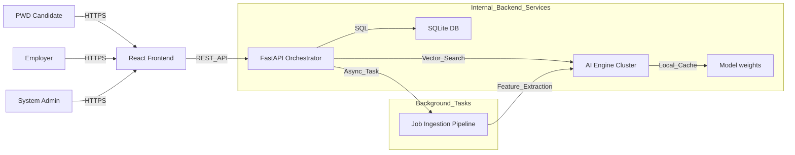
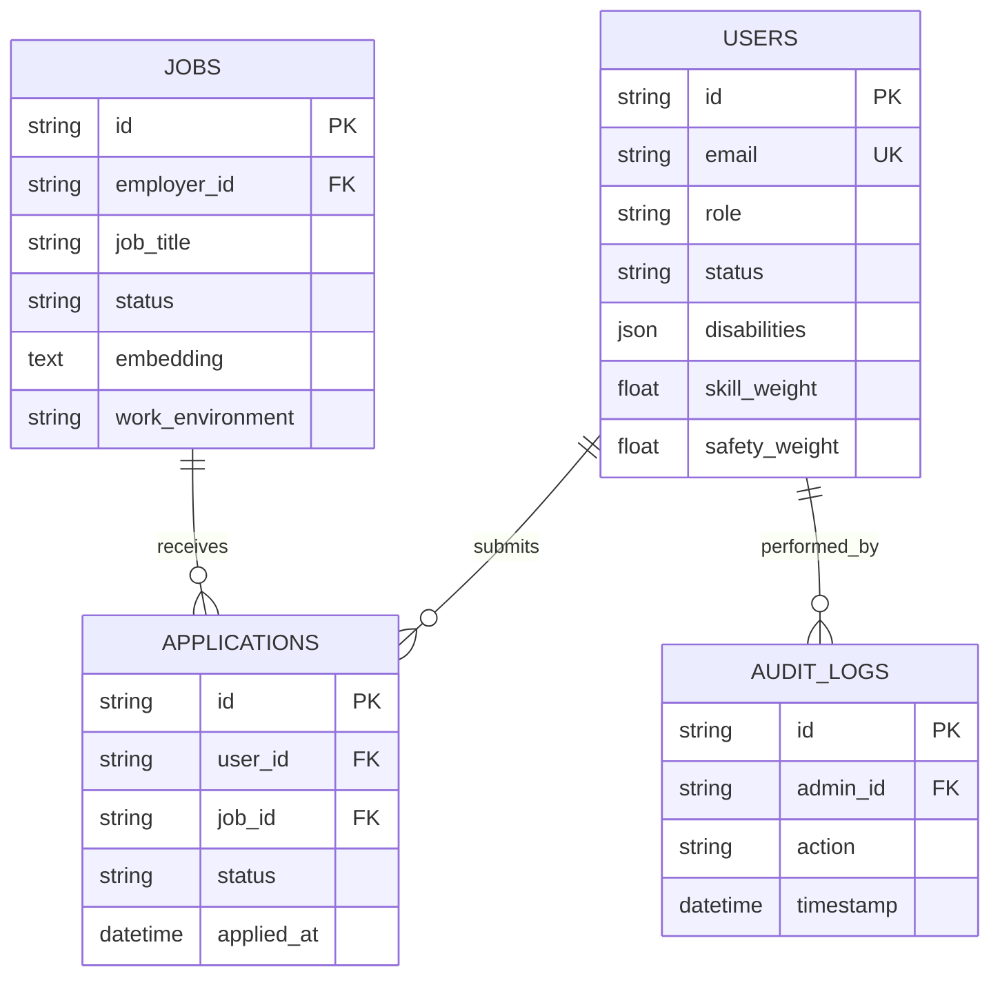
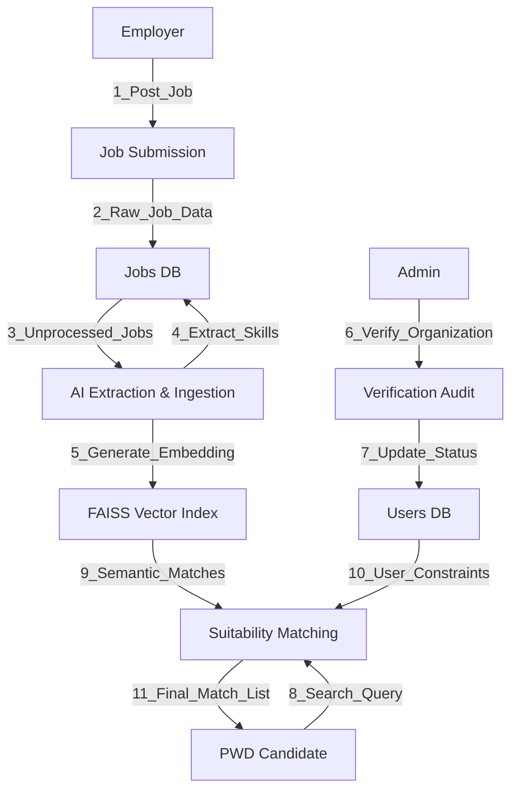
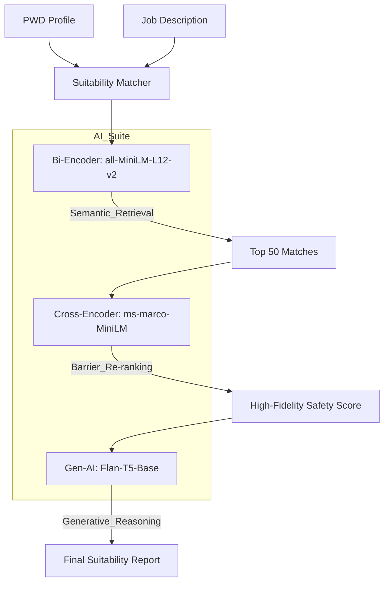
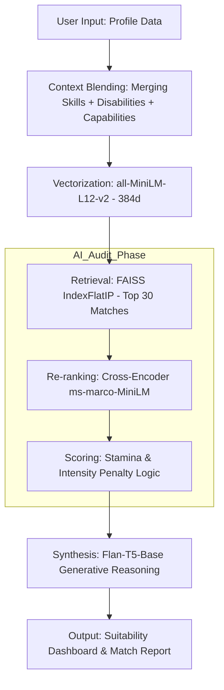

# UPLIFT: System Documentation (v7.1)

## 1. System Requirements (Hardware and Software)

### Narrative: Technical Rationale

The UPLIFT system is designed as an AI-heavy vocational engine. Unlike traditional web applications, it maintains multiple transformer models in memory for real-time semantic analysis.

- **Software Rationale**: **Python (FastAPI)** was selected as the backend orchestrator due to its first-class support for AI/ML libraries and asynchronous handling of long-running ingestion tasks. **React (Vite)** powers the frontend to provide a highly responsive, component-based interface that is essential for implementing complex accessibility features (WCAG 2.1).
- **Hardware Rationale**: A minimum of **16GB RAM** is strongly recommended. This is because the system loads three distinct AI models: a Bi-Encoder for search, a Cross-Encoder for validation, and a Large Language Model (Flan-T5) for generative reporting. These models collectively require significant memory overhead to ensure "search-engine fast" response times without disk swapping. A **Quad-core processor** is necessary to handle the parallel processing required by the FAISS vector engine during high-concurrency searches.

| Category           | Specification             | Narrative                                                                              |
| :----------------- | :------------------------ | :------------------------------------------------------------------------------------- |
| **Software (OS)**  | Windows 10+, Linux, macOS | Provides the underlying kernel support for Python's multiprocessing and AI threading.  |
| **Software (Dev)** | Python 3.9+, Node.js 18+  | Essential runtimes for the FastAPI backend and React frontend respectively.            |
| **Hardware (CPU)** | Quad-core 2.5GHz+         | Necessary for efficient mathematical computations in vector search and AI inference.   |
| **Hardware (RAM)** | 8GB (Min) / 16GB (Rec)    | Critical for holding heavy transformer models in memory for sub-second response times. |
| **Hardware (GPU)** | NVIDIA (Optional)         | Recommended for production scales to offload AI inference from the CPU.                |

---

## 2. People (Use Cases)

### Use Case Narrative

The UPLIFT ecosystem involves three primary stakeholders, each interacting with the system to fulfill a specific stage of the vocational lifecycle.

1.  **PWD Candidates (The Job Seekers)**:
    - _Role_: Individuals with various disabilities (Physical, Visual, Hearing, etc.) seeking career opportunities.
    - _Action_: They use the dashboard to find AI-validated "Safe Matches," adjust matching weights based on their personal stamina/skill preferences, and receive generative "Suitability Reports" that explain how a job fits their specific condition.
2.  **Employers (The Inclusive Organizations)**:
    - _Role_: Companies aiming to diversify their workforce.
    - _Action_: They undergo a mandatory 3-step verification process (Legal Audit). Once verified, they post jobs with high-fidelity accessibility metadata. They use the portal to review applicant suitability and manage hiring workflows.
3.  **System Administrators (The Auditors)**:
    - _Role_: Overseers of the marketplace integrity.
    - _Action_: They manually audit organization credentials (SEC/DTI permits) and job postings before they enter the AI index. They monitor system health and audit logs to ensure a safe environment for all users.

---

## 3. Network Architecture

### Network Diagram



### Narrative: Data Connectivity

The system operates on a **Client-Server Architecture**. The **Frontend (React)** acts as the presentation layer, communicating with the **Backend (FastAPI)** via a secure REST API. All sensitive transactions (Auth/Approvals) are secured via **JWT (JSON Web Tokens)**.
Internally, the backend manages a low-latency connection to a **local SQLite database** for relational storage and a high-performance **FAISS index** for vector-based search. Background workers handle the "heavy lifting" of AI ingestion, ensuring that the primary user experience remains fluid while complex NLP extractions occur in the background.

---

## 4. Dataware (Architecture & Diagrams)

### Entity Relationship Diagram (ERD)



### Data Flow Diagram (DFD - Level 1)



### Dataware Narrative

The Dataware layer of UPLIFT is a **Hybrid Relational-Vector system**.

1.  **Relational Model (SQLite)**: Acts as the "System of Record," maintaining user profiles, legal documentation, and transactional application data.
2.  **Vector Model (FAISS)**: Acts as the "Semantic Memory." It stores the high-dimensional latent representations of jobs. This allows the system to find jobs based on _meaning_ rather than just keywords.
3.  **Data Life Cycle**: A job begins as "Unprocessed Text" (P1), passes through the "Ingestion Pipeline" (P2) where AI models decompose it into structured features (intensity, tempo, skills), and is finally stored in both the Relational DB (metadata) and Vector Index (semantics).

### Technical Detail: AI Ingestion (P2)

- **Model Architecture**: Google's `Flan-T5-Base` (**Seq2Seq Transformer**).
- **Method**: **Zero-Shot Task Instruction**.
- **The Specific Prompt**:
  ```text
  Context: {job_description} {physical_requirements}
  Question: What is the task intensity (Low, Medium, High)? Does it offer schedule flexibility (Yes, No)? List the professional skills.
  Answer format: Intensity: [type], Flexibility: [Yes/No], Skills: [list]
  ```
- **Post-Inference (Regex Parsing)**: The model's natural language response is parsed via:
  - `r'Intensity:\s*(\w+)'` -> Extracts Intensity level.
  - `r'Flexibility:\s*(\w+)'` -> Maps "Yes" to Boolean.
  - `r'Skills:\s*(.*)'` -> Captures skill strings.

### Technical Detail: Suitability Engine (P3)

- **Stage 1 (Retrieval)**: Uses `all-MiniLM-L12-v2` (**Bi-Encoder**) for producing **384-dimensional vectors**. Indexed in **FAISS** via `IndexFlatL2`.
- **Stage 2 (Re-ranking)**: Uses `ms-marco-MiniLM` (**Cross-Encoder**) for high-fidelity validation. Unlike Bi-Encoders, it processes the User+Job pair as a single input for deeper relationship modeling.
- **Stage 3 (Synthesis)**: Uses `Flan-T5-Base` to generate a personalized suitability narrative.

### NLP Conceptual Diagram (The Brain)



---

## 8. Technical Deep-Dive: Algorithms & Mathematics

### Narrative Context: The Algorithmic Strategy
The UPLIFT algorithmic layer is not just about search; it is about **Vocational Risk Mitigation**. The system uses a multi-stage approach to balance retrieval speed with high-fidelity safety auditing:

1.  **Stage 1: Semantic Recall (Bi-Encoders)**: Chosen for their ability to project profiles and jobs into a shared hyperspace. This allows the system to find "intent-based" matches in milliseconds, which is necessary for scaling to thousands of job listings.
2.  **Stage 2: High-Fidelity Audit (Cross-Encoders)**: Unlike Stage 1, this processes the User and Job as a single interaction. This is the "Safety Layer" designed to detect subtle environmental barriers that a simple search might miss.
3.  **Stage 3: Expert Heuristics (Stamina Math)**: This layer incorporates discrete vocational knowledge. It treats "burnout" as a mathematical function of task intensity and scheduling flexibility, ensuring that matches are not just "skilled" but "sustainable."

---

### A. Vector Similarity & Retrieval (Stage 1)
UPLIFT utilizes **IndexFlatIP** (Inner Product) indexing via FAISS. 
- **L2 Normalization**: Both query and job vectors are L2-normalized before search. 
- **The Formula**: For normalized vectors, Inner Product is mathematically equivalent to **Cosine Similarity**:
  $$\text{Score} = \cos(\theta) = \frac{\mathbf{A} \cdot \mathbf{B}}{\|\mathbf{A}\| \|\mathbf{B}\|}$$
- **Normalization Strategy**: Raw similarity scores (typically `0.25` to `0.75`) are mapped to a `0-100` range using:
  $$\text{Bi-Score} = \min\left(100, \max\left(0, \frac{\text{raw\_sim} - 0.25}{0.5} \times 100\right)\right)$$

### B. High-Fidelity Safety Score (Stage 2)
The system uses a **Hybrid Re-ranking** strategy (30% Bi-Encoder, 70% Cross-Encoder).
- **Cross-Encoder Calibration**: Cross-encoder logits are converted to percentages using a modified Sigmoid function with temperature scaling ($T=1.2$) and an optimistic bias ($+1.5$):
  $$\text{Cross-Score} = \left( \frac{1}{1 + e^{-(logit + 1.5) / 1.2}} \right) \times 100$$
- **Rationale**: The bias ensures that jobs are not overly penalized for missing data, while the temperature softens the decision boundary for more nuanced matching.

### C. Sustainability & Stamina Logic
The **Stamina Score** starts at `100.0` and applies discrete vocational penalties:
1.  **Intensity Mismatch**: If `Job Intensity > User Preference`, a penalty is applied:
    $$\text{Penalty} = (I_{job} - P_{user}) \times 25$$
2.  **Burnout Risk**: A `-20` point penalty is applied if a job is "High Intensity" AND has no "Schedule Flexibility."
3.  **Flexibility Requirement**: A `-30` point penalty is applied if a user explicitly requires flexibility but the job does not offer it.

### D. Final Hybrid Match %
The final score presented to the user is a weighted average based on their **Profile Sliders**:
$$\text{Final \%} = (W_{skill} \times S_{skill}) + (W_{safety} \times S_{safety}) + (W_{stamina} \times S_{stamina})$$
*Where $W$ is the weight (0.0 - 1.0) and $S$ is the component score.*

------

## 10. End-to-End System Flow (PWD Journey)

### A. The Journey Flowchart


### B. Process Narrative
1.  **Stage 1: Profile Ingestion**: The user enters their summary, skills, and disabilities. The system doesn't just store these; it "blends" them into a rich natural language context that captures both their professional strengths and their specific accessibility needs.
2.  **Stage 2: Latent Representation**: This context is fed into the **Bi-Encoder**, which converts the text into a latent representation (a vector). This vector acts as a "Vocational Fingerprint" in a 384-dimensional space.
3.  **Stage 3: High-Speed Retrieval**: When the user searches, the system uses **FAISS** to compare their "Fingerprint" against every job in the database. It instantly retrieves the top 30 most semantically similar jobs.
4.  **Stage 4: Suitability Audit**: For these 30 jobs, a **Cross-Encoder** performs a side-by-side comparison between the user's specific profile and the job's physical requirements. It looks for "Hidden Barriers" (e.g., a "desk job" requiring frequent transit).
5.  **Stage 5: Heuristic Scoring**: The system then applies the **Sustainability Math**. It checks if the job's "Task Intensity" matches the user's "Preferred Intensity" and deducts points for burnout risks (e.g., high intensity without schedule flexibility).
6.  **Stage 6: Generative Synthesis**: Finally, the top results are sent to **Flan-T5-Base**. The AI reads the match data and writes a personalized report explaining *why* the job is suitable, providing career advice and identifying potential challenges.
7.  **Stage 7: Interactive Output**: The PWD user sees a list of jobs ranked by their custom weights (Skills vs. Safety vs. Stamina), complete with a "Suitability Report" and a 1-100% Match Score.

## 9. Summary of Innovation
UPLIFT transforms recruitment from a search-and-apply process into a **Suitability-Validated** journey. By integrating expert vocational knowledge with state-of-the-art NLP, it ensures that PWDs find roles where they can not only work but thrive safely.---

## 11. OCR ID Verification & Performance Management

### A. The OCR Pipeline (PaddleOCR-VL)
To automate the verification of PWD IDs, the system integrates **PaddleOCR-VL** (Vision-Language) into the verification workflow.
- **Model Type**: Multimodal Vision-Language Transformer.
- **Advanced Task**: Unlike standard OCR, **PaddleOCR-VL** performs **Layout-Aware Information Extraction**. It doesn't just read text; it understands the spatial relationship between fields (e.g., linking the "Name" label to the actual name text).
- **Process**:
    1.  **Multimodal Encoding**: Simultaneously processes the image pixels and the text tokens.
    2.  **Structured Extraction**: Directly extracts "ID Number", "Full Name", and "Disability Type" into a JSON object.
    3.  **Security Cross-Check**: Automatically compares the OCR data against the user's registered profile to detect fraud or input errors.

### B. Performance Optimization (Bottleneck Prevention)
Given the heavy memory footprint of the existing AI Cluster (Bi-Encoder, Cross-Encoder, Flan-T5), the OCR engine is managed using **Strategic Resource Allocation**:

1.  **Lazy Model Loading**: The OCR weights are not loaded into VRAM/RAM during system startup. The model is initialized only when a user triggers the `upload_id` endpoint.
2.  **Memory Offloading**: After extraction is complete, the model instance is deleted, and the system calls `gc.collect()` and `torch.cuda.empty_cache()` to free up memory for the Matching Engine.
3.  **Asynchronous Ingestion**: The OCR process runs as a **FastAPI BackgroundTask**. This ensures that the main API thread remains responsive to other users searching for jobs while the heavy computer vision task is being performed.
4.  **Quantization**: The OCR model uses **INT8 Quantization** to reduce its memory footprint by up to 50% without significantly impacting character recognition accuracy.

---

## 12. Standardized Resume Management (RenderCV)

To ensure PWD candidates are presented with the highest level of professionalism, UPLIFT-AI implements **RenderCV**, a Python-native LaTeX resume generation engine. This ensures all resumes are not only standardized but typeset to academic and professional industry standards.

### A. The "Apply Now" Workflow
When a user clicks "Apply Now," they enter a dual-path vocational branding flow:

1.  **Path A: AI-Powered Profile Extraction**:
    - **Process**: User uploads a legacy PDF/Docx.
    - **Parsing Engine**: **pydparser** (Python Resume Parser) extracts structured professional data (Skills, Education, Experience) with high precision.
    - **NLP Mapping**: **Flan-T5** refines the extracted entities and maps them into a **RenderCV YAML/Dictionary structure**.
    - **Validation**: The system validates the data against the `RenderCV` schema to ensure every required field (Contact, Education, Experience) is present.

2.  **Path B: Guided Resume Builder**:
    - **Process**: A clean, accessible form captures the user's career narrative.
    - **Optimization**: AI-assisted bullet-point enhancement (via Flan-T5) helps PWD users articulate their skills and necessary workplace accommodations in a professional tone.

### B. LaTeX Rendering Engine (RenderCV)
Unlike standard HTML-to-PDF tools, the system leverages **LaTeX** via the `RenderCV` library:
- **Typographic Excellence**: Resumes are rendered with mathematical precision in layout, providing a premium feel that stands out to employers.
- **Python-Native Pipeline**: Since `RenderCV` is a Python library, it is integrated directly into the FastAPI backend, eliminating the need for external CLI bridges or Node.js dependencies.
- **Multiple Themes**: Supports professional templates (e.g., `classic`, `moderncv`) that are automatically selected based on the job category.

### C. Technical Architecture of the Resume Pipeline
The system utilizes a 100% Python-based pipeline for maximum efficiency:

1.  **Stage 1: Entity Extraction**: **pydparser** and **Flan-T5** work in tandem to process the user's profile and raw text, outputting a structured Python Dictionary following the `RenderCV` model.
2.  **Stage 2: Schema Enforcement**: Data is validated using `Pydantic` (integrated into FastAPI) to ensure compatibility with LaTeX rendering requirements.
3.  **Stage 3: Native Rendering**: The system calls `rendercv.render()` internally. This process generates a `.tex` file in memory and compiles it into a high-fidelity `.pdf`.
4.  **Stage 4: Accommodation Integration**: A unique "Accessibility & Accommodations" section is dynamically injected into the LaTeX source, ensuring that the employer is informed of the candidate's needs in a standardized, professional format.

---

## 9. Summary of Innovation
UPLIFT transforms recruitment from a search-and-apply process into a **Suitability-Validated** journey. By integrating expert vocational knowledge with state-of-the-art NLP, it ensures that PWDs find roles where they can not only work but thrive safely.
